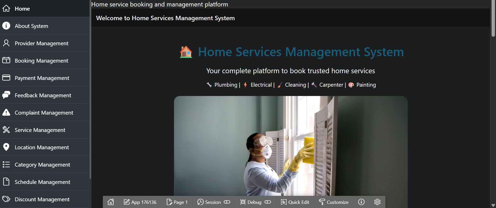
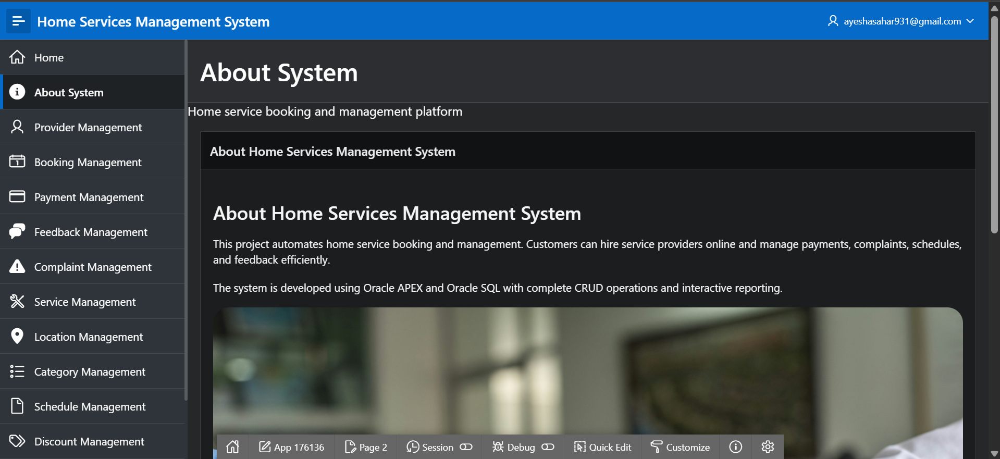
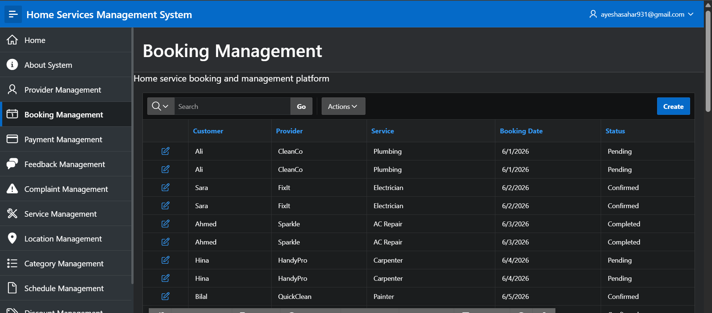
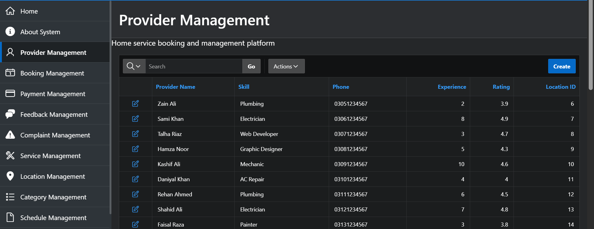
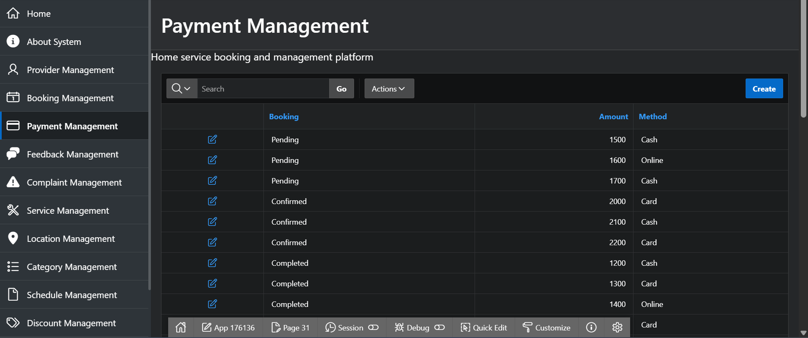
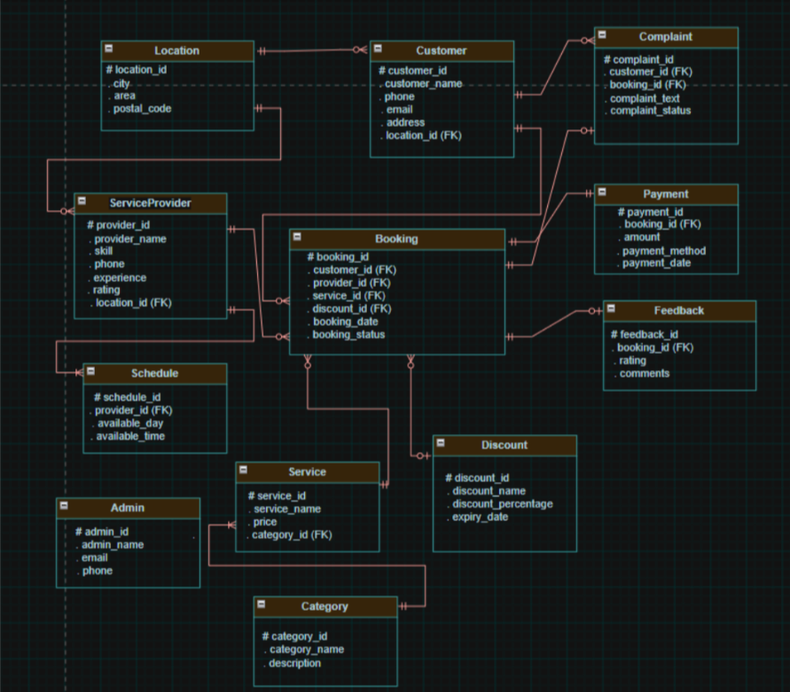

# 🏠 Home Services Management System

A database-driven **Home Services Management System** developed using **Oracle APEX and Oracle SQL**. The system is designed to efficiently manage customers, service providers, services, bookings, payments, feedback, complaints, schedules, locations, categories, discounts, and administrative operations.

This project demonstrates practical implementation of **database design, ER modeling, relational schema development, SQL queries, data management, and CRUD operations using Oracle APEX**.

---
## 🎥 Application Demo

[▶️ View Application Demo](./demo/home-services-demo.mp4)

## 📌 Project Overview

In today's urban lifestyle, finding reliable and professional home service providers such as electricians, plumbers, cleaners, carpenters, and painters can be difficult through traditional methods.

The **Home Services Management System** provides a structured database-driven solution for managing home-service operations. Customers can book services, service providers can manage their schedules and assigned bookings, and administrators can monitor and manage the overall system.

The system maintains organized records of bookings, payments, discounts, feedback, complaints, service categories, provider schedules, and locations.

---

## ✨ Features

* 👤 Customer management
* 👨‍🔧 Service provider management
* 🔧 Home service management
* 📅 Booking management
* 💳 Payment management
* ⭐ Customer feedback and ratings
* 💬 Complaint management
* 🗂️ Service categories
* 🕐 Service provider schedules
* 📍 Location management
* 🏷️ Discount management
* 👨‍💼 Admin management
* 🔍 Record viewing and searching
* ✏️ Record updating
* ➕ Record creation
* 🗑️ Record deletion
* 📊 SQL queries and advanced database operations

---

## 🛠️ Technologies Used

* **Oracle APEX**
* **Oracle Database**
* **SQL**
* **Relational Database Management System (RDBMS)**
* **ER Modeling**
* **Crow's Foot ERD**

---

## 🗄️ Database Entities

The system consists of **12 main entities**:

| #  | Entity           | Description                               |
| -- | ---------------- | ----------------------------------------- |
| 1  | Customer         | Stores customer information               |
| 2  | Service Provider | Stores service provider details           |
| 3  | Service          | Stores available home services and prices |
| 4  | Booking          | Stores customer service bookings          |
| 5  | Payment          | Stores payment information                |
| 6  | Feedback         | Stores customer reviews and ratings       |
| 7  | Admin            | Stores administrator information          |
| 8  | Category         | Organizes services into categories        |
| 9  | Schedule         | Stores provider availability              |
| 10 | Location         | Stores customer and provider locations    |
| 11 | Complaint        | Stores customer complaints                |
| 12 | Discount         | Stores promotional discount details       |

---

## 🔗 Database Relationships

The database is designed using primary keys and foreign keys to establish relationships between the entities.

Major relationships include:

* **Customer → Booking**
* **Service Provider → Booking**
* **Service → Booking**
* **Category → Service**
* **Location → Customer**
* **Location → Service Provider**
* **Booking → Payment**
* **Booking → Feedback**
* **Service Provider → Schedule**
* **Customer → Complaint**
* **Booking → Complaint**
* **Discount → Booking**

The ERD represents the relationships and cardinalities between the entities using a **Crow's Foot notation**.

---

## 🧩 CRUD Operations

The Oracle APEX application implements the four fundamental CRUD operations:

### ➕ Create

Allows users to add new records to the system.

### 👁️ Read

Allows users to view and search existing records.

### ✏️ Update

Allows existing records to be modified when information changes.

### 🗑️ Delete

Allows unwanted records to be removed from the system.

These operations demonstrate practical database interaction through the Oracle APEX interface.

---

## 📊 SQL & Database Operations

The project includes several database operations, including:

* Creating relational tables
* Defining primary keys
* Defining foreign keys
* Applying constraints
* Inserting sample records
* Joining multiple tables
* Aggregate functions with `GROUP BY`
* Subqueries
* Set operations such as `UNION`, `INTERSECT`, or `EXCEPT`
* CRUD operations
* Relational database management

---

# 📸 Project Screenshots

## 🏠 Home Page

The main landing page of the Home Services Management System.



---

## ℹ️ About System

Provides an overview and information about the Home Services Management System.



---

## 📅 Booking Management

The booking management interface used to manage customer service bookings.



---

## 👨‍🔧 Provider Management

The provider management interface used to manage service provider information.



---

## 💳 Payment Management

The payment management interface used to maintain payment records associated with bookings.



---

## 🗺️ Entity Relationship Diagram

The ERD represents the database structure, entities, attributes, primary keys, foreign keys, and relationships within the system.



---

## 📂 Repository Structure

```text
Home-Services-Management-System/
│
├── apex/
│   └── home_services_management_system.sql
│
├── screenshots/
│   ├── HomePage.png
│   ├── AboutSystem.png
│   ├── BookingManagement.png
│   ├── Providermanagement.png
│   ├── PaymentManagement.png
│   └── erd.png
│
└── README.md
```

---

## 🚀 How to Run the Application

1. Download the Oracle APEX application export from the `apex` folder.
2. Open an Oracle APEX workspace.
3. Go to **App Builder → Import**.
4. Select the application `.sql` export file.
5. Follow the import process.
6. Run the imported application.
7. Explore the available modules and database operations.

> The application export is provided in the repository so that the Oracle APEX application can be imported into a compatible APEX environment.

---

## 🎯 Learning Outcomes

This project provided practical experience in:

* Relational database design
* Entity and relationship identification
* ER diagram development
* Database schema design
* SQL table creation
* Primary and foreign key implementation
* Data insertion and management
* SQL queries
* CRUD operations
* Oracle APEX application development
* Forms and reports
* Database-driven application development

---

## 👩‍💻 Author

**Ayesha Sahar**

Database Project — **COMSATS University Islamabad**

**Course:** Databases
**Semester:** Third

---

## 📄 Project Documentation

The repository contains the **Oracle APEX application export**, project screenshots, and database design resources for the Home Services Management System.

